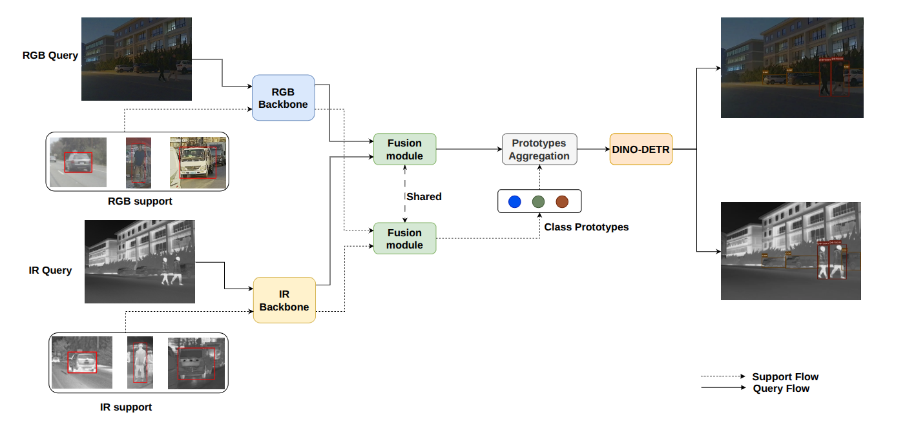

# FSMODNet: A Closer Look at Few-Shot Detection in Multispectral Data

## 📄 Abstract

Few-shot multispectral object detection (FSMOD) addresses the challenge of detecting objects across visible and thermal modalities with minimal annotated data. In this paper, we explore this complex task and introduce a framework named "FSMODNet" that leverages cross‑modality feature integration to improve detection performance even with limited labels.
By effectively combining the unique strengths of visible and thermal imagery using deformable attention, the proposed method demonstrates robust adaptability in complex illumination and environmental conditions. Experimental results on two public datasets show promising object detection performance in challenging low-data regimes.


## 📷 Overview
<p align="center">
        
</p>

## 🧩 Installation
1. Download this repo
```bash
cd FSMODNet
```
2. Install required packages
```bash
pip install torch==2.6.0 torchvision==0.21.0 --index-url https://download.pytorch.org/whl/cu124
pip install natten==0.17.5+torch260cu124 -f https://whl.natten.org
pip install -r requirements.txt
``` 
3. Compiling CUDA operators
As the framework is developed upon Deformable DETR, you need to compile Deformable Attention.
```bash
cd models/dino/ops
python setup.py build install
# unit test (should see all checking is True)
python test.py
cd ../../..
```

## 📁 Datasets 
Download and place FLIR and M3FD datasets in data/ with the expected folder structure.

### FLIR
```bash
data/FLIR/
├── Coco_Annotations/         # COCO-style JSON annotations
├── JPEGImages/               # RGB–thermal image pairs
├── few_shot/                 # Few-shot split files (per class/split/shot)
``` 
### M3FD
You need to put each dataset imgs in the directory according to the train.txt and val.txt.
```bash
data/M3FD/
├── Coco_Annotations/         # COCO-style annotations for all conditions
├── train.txt
├── test.txt
├── visible/
│   ├── train/
│   └── test/
├── infrared/
│   ├── train/
│   └── test/
├── few_shot/                 # Few-shot split files
``` 

## 🏁 Training
### Base training
We take FLIR as example. First, create meta_learning.sh and copy the following commands to it.
```bash
dataset='FLIR'
split=1
spectrum='both'
backbone='Resnet'
data_dir='data/'${dataset}
root='exps'
mkdir -p $root
output_dir=$root/${dataset}/split${split}/${backbone}/${spectrum}
ckpt=$output_dir/meta_learning/detector.ckpt
mkdir -p $output_dir/meta_learning

python training.py \
        --config configs/FLIR/Resnet_stage2.py \
        --output_dir $output_dir --data_dir $data_dir \
        --split $split --spectrum $spectrum --dataset $dataset \
        --stage 2 \
	    2>&1 | tee ${output_dir}/meta_learning/log.txt
```
Then run the command below
```bash
./meta_learning.sh
```

### Few-shot finetuning
We take FLIR as example. First, create fs.sh and copy the following commands to it.
```bash
dataset='FLIR'
split=1
seed=1
kshot=10
spectrum='both'
backbone='Resnet'
data_dir='data/'${dataset}
root='exps'
output_dir=$root/${dataset}/split${split}/${backbone}/${spectrum}
ckpt=$output_dir/meta_learning/detector.ckpt
mkdir -p ${output_dir}/${kshot}_shot

python training.py \
        --config configs/FLIR/Resnet_stage3.py \
        --output_dir $output_dir --data_dir $data_dir \
        --split $split --spectrum $spectrum --dataset $dataset \
        --stage 3 --checkpoint $ckpt --k_shot $kshot \
        --warmup_steps 100 --seed $seed   \
	    2>&1 | tee ${output_dir}/${kshot}_shot/log_$seed.txt
```
Then run the command below
```bash
./fs.sh
```
## 📌 Citation

## 👍 Acknowledgement
FSMODNet is built on previous works such as [Meta-DETR](https://github.com/ZhangGongjie/Meta-DETR),[DINO-DETR](https://github.com/IDEA-Research/DINO) and [NATTEN](https://github.com/SHI-Labs/NATTEN). We sincerely thank the authors of these foundational works for making their code and research publicly available, which greatly facilitated the development of FSMODNet.
